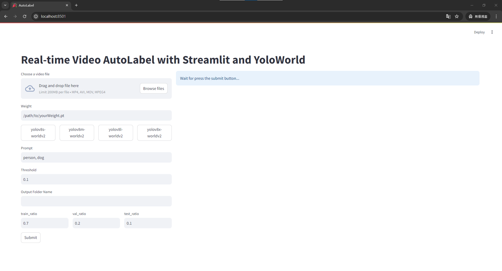
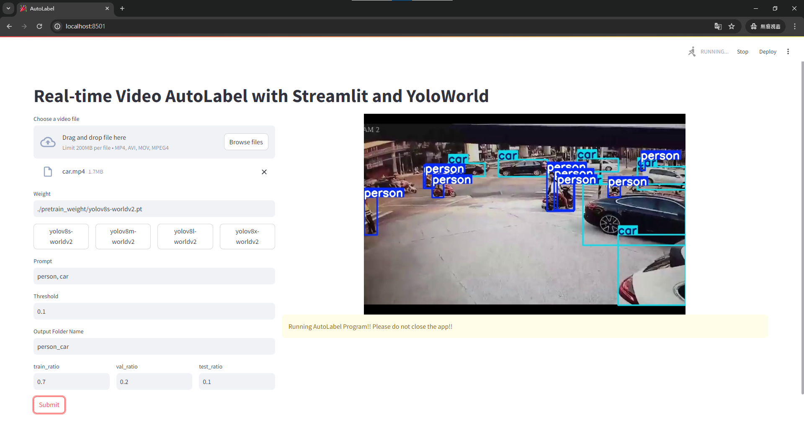
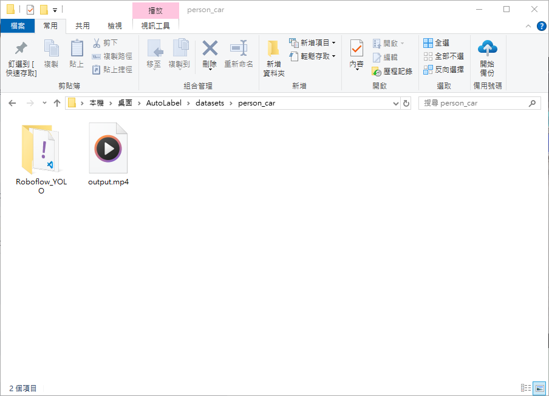
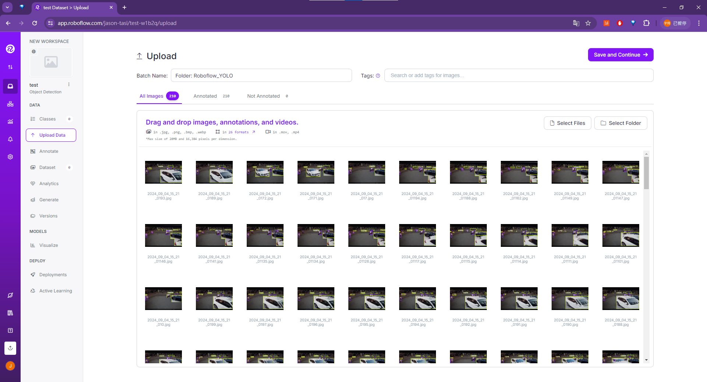

# AutoLabeling Tool by YoloWorld & Streamlit

## Overview

This application was inspired by my internship experience. I was in charge of a project where our boss would sometimes give us new data (often videos) and ask us to complete tasks like data cleaning, annotation, model training, evaluation, and deployment within 2 to 4 days, with just three people working on this project (including myself). I created this tool to help us work more efficiently. It allows me to delegate annotation tasks to colleagues without AI development experience, which speeds up the process and lets me focus on training the model, evaluating it, designing and implementing the auto-labeling process, and deploying the final application.

## Main Features

1. **Using YoloWorld for zero-shot detection:** YoloWorld is a model based on open vocabulary detection tasks. This model can detect any object in an image based on descriptive text, without requiring any training.
2. **AutoLabeling:** Automatically extract each frame of a video as an image and generate annotations, then assemble them into a dataset that can be directly used for YOLO training.
3. **Friendly UI Interface:** Create a GUI interface that allows users to input their parameters, such as video, model weights, prompts, thresholds, data split ratio, and output folder path. The interface should also provide real-time AutoLabeling views to help users monitor the status of the automated annotations.

## How to Run

To run this program, follow these steps:

1. **Create a Python>=3.8 environment with PyTorch>=1.8.**
    - [Installing latest versions of PyTorch](https://pytorch.org/get-started/locally/)
    - [Installing previous versions of PyTorch](https://pytorch.org/get-started/previous-versions/)

2. **Install ultralytics and streamlit**

    ```sh
    pip install ultralytics
    pip install streamlit
    ```

3. **Download this Project**

    ```sh
    git clone https://github.com/iamrock123/AutoLabeling-Tool-by-YoloWorld-and-Streamlit.git
    ```

4. **Run the Project**

    ```sh
    streamlit run ./auto_label.py
    ```

    - If you have installed all the dependencies and executed the commands correctly, you will see the following screen.

    

### How to operate the GUI interface

Please follow the steps below to perform automatic annotation.

- Upload video file.
- Double-click the pre-trained model weights from ultralytics. (Alternatively, you can directly enter your re-trained model weights in the text field. In my actual use, [re-training](https://docs.ultralytics.com/models/yolo-world/) with a small dataset can produce better annotation results for specific tasks compared to using pre-trained models from ultralytics.)
- Enter the categories you want to annotate in the prompt's text field. Then, input the threshold (between 0 and 1), the dataset output location, and the data split ratio (also between 0 and 1).
- After completing all the settings, please press the submit button and wait for a short period (depending on your hardware, GPU is recommended). You will then see the real-time annotation results displayed on the right side.

    

    [video source](https://www.youtube.com/watch?v=lf_nNch_5iw)

- After the automatic labeling is complete, you can check the results in `./datasets/YOUR_OUTPUT_LOCATION`. The `Roboflow_YOLO` folder can be used for direct YOLO training or uploaded to the Roboflow platform. The `output.mp4` file contains the video with the automatic annotation boxes.

    
  
  You can also upload the entire Roboflow_YOLO folder for testing.
  
    

## References

- [YOLO-World Model](https://docs.ultralytics.com/models/yolo-world/)
- [streamlit](https://streamlit.io/)
- [video source](https://www.youtube.com/watch?v=lf_nNch_5iw)
